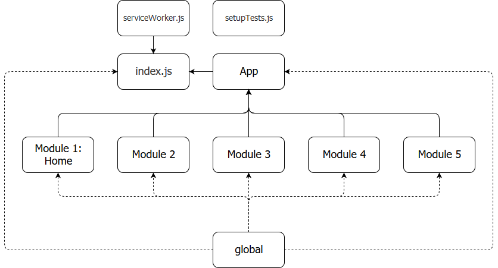

# React Project Structure

The structure of a project is nothing but the way in which its files are to be organized. This is important since a properly structured project should enable developers to:-

1. Add new code in a consistent, independent and stable way. 
2. Make it easy to diagnose code that could malfunctioning by allowing developers to handle that code in a targeted manner without affecting other code
3. Remove or update code in a predictable and safe way

### Explanation

A proper structure should have a clearly defined architecture and set of instructions on how to make changes as a whole to the project. For these reasons, we at **onCreators** have chosen to follow a Modular Project Structure with emphasis on splitting code into individual and independent modules that can be added and removed without affecting the project in any way.



The Above structure denotes how active dev files are to be stored in the source folder (/src) of the project. There are a couple of important entities to note here:-

- **global**: This contains a set of styles, constants, assets, references to databases and functions to interact with them etc. It provides all of these to every other entity in the architecture. The global can even contain components which are meant to be available to all other entities (In this architecture, there are several levels to components being used, the same will discussed later).

  If there is something that needs to be made globally available, then that must be put in the global. Note however that the global must never import from anything other than itself or the node modules.

  ```
  /global
  	/assets
  	/database
  	/components
  	database.js
  	assets.js
  	constants.js
  	styles.js
  ```

  

- **App**: This is a point of convergence where all the modules in the project come together. Aside from the this the App also serves as the entry point into the website, and it also the place where anything common amongst all modules (like an AppBar for example) can be put. The App also has a MobX store which serves as a common datastore for all other modules. It is common best practice to never let any individual module to use any other stores apart from its own store and the App's store since each module is to behave independently of other modules.  

  The App also collects all the stores from all the other modules and delivers them to the provider at the index.js. It contains a controller which manages most of data movement between the database and the MobX stores. Thus the App is essentially a manager of all other module 

  ```
  /App
  	App.js
  	App.test.js
  	App.styles.js
  	App.store.js
  	App.stores.js
  	App.controller.js
  	App.components.js
  	App.functions.js
  ```

- **Module**: The module is a container or page that acts as one of the constituents or parts that make up the project. Each module is individualistic that is each module can function completely by itself with the help of global and the App. Each module is also independent, in that changing one module or even removing a module entirely doesn't affect other modules in any way. (This often means that any communication between modules has to be done either by creating another module built specifically for that task or through the App, and the communication channel must be setup in such a way that all modules that are a part of that channel can still function without it)

  Each module has its own entry point, usually a JavaScript file named Module.js and it also has its own MobX store which acts as the common data source for that module. Each module also has a set of components specific to that module. 

  While it can challenging to design code this way, the benefits it offers war outweigh the difficulties.

  ```
  /Module
  	/components
  	Module.js
  	Module.test.js
  	Module.store.js
  	Module.components.js
  	Module.styles.js
  	Module.functions.js
  ```

- the **index.js** is what exposes the App to the outside environment, by taking everything it need from the global and the App (which in turn provides all the modules to it as well). The index.js is also where the MobX provider sits and where the option to opt in for service workers is also available (this is done via the **serviceWorker.js**). The **setupTests.js** is used to set the Jest and Enzyme Adapter.

### Component Levels

One thing you might've noticed in previous explanation is the presence of the components folder in several places. And this is because, the components in this architecture can exist at 3 levels. They are:- 

- **Local**: These are components that are meant to be used specifically in another single larger component. Thus they essentially act as smaller constituents of the larger component. So when deciding whether to create a local component, remember that if a component cannot be used anywhere else other than one specific component, then it can be a local component

  All local components for another component is are put inside a [the larger component's name].components.js file. So for example, if we were creating components for the Appbar component, they would be in a Appbar.components.js  

- **Module**: Module-level components are those components which are specific to one module. On several occasions in programming, there are instances where certain components are only useful within a single module and cannot be effectively used in other modules, so rather than try to use them, we simply classify them as being unique to that module only.

  All module components are put inside a components folder in the [Module's name] folder.

- **Global**: These are components that are meant to be available across modules and generally speaking throughout the entire project.

While it can seem a bit cumbersome to categorize components this way, it is the most efficient way to assess the impact of changing or updating a component and also remove components which are no longer required.  